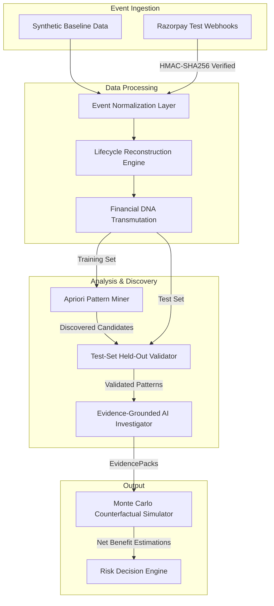

# Architecture

```mermaid
graph TD
    %% Ingestion Sources
    subgraph Event Ingestion
        A[Synthetic Baseline Data]
        B[Razorpay Test Webhooks]
    end

    %% Pipeline Processing
    subgraph Data Processing
        C[Event Normalization Layer]
        D[Lifecycle Reconstruction Engine]
        E[Financial DNA Transmutation]
    end

    %% Analytical Engine
    subgraph Analysis & Discovery
        F[Apriori Pattern Miner]
        G[Test-Set Held-Out Validator]
        H[Evidence-Grounded AI Investigator]
    end

    %% Decision
    subgraph Output
        I[Monte Carlo Counterfactual Simulator]
        J[Risk Decision Engine]
    end

    A --> C
    B -->|HMAC-SHA256 Verified| C
    
    C --> D
    D --> E
    
    E -->|Training Set| F
    F -->|Discovered Candidates| G
    E -->|Test Set| G
    
    G -->|Validated Patterns| H
    H -->|EvidencePacks| I
    
    I -->|Net Benefit Estimations| J
```
